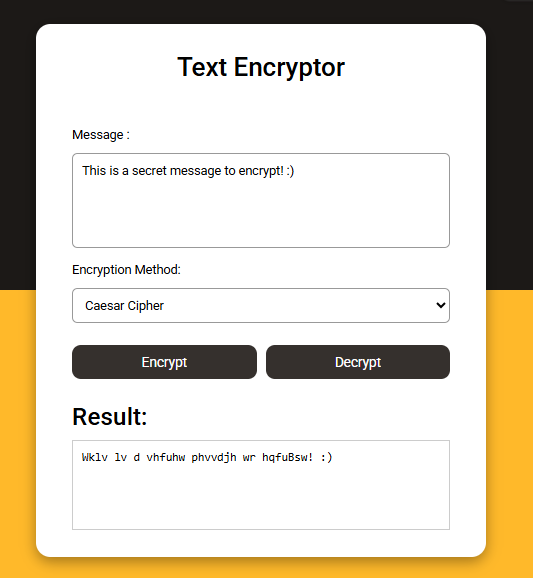

# Text Encryptor
Text Encrypter é uma ferramenta simples e eficiente para criptografar e descriptografar textos. Ideal para fins educacionais, demonstrações de segurança básica ou aplicações que precisam de uma camada adicional de proteção de dados em texto puro.

# Screenshot
Aqui temos a captura de tela do projeto:

